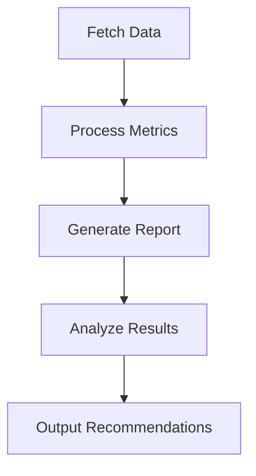

# Weather Data Analyzer (Go Implementation)

A concurrent Go application that fetches and analyzes weather data from Yandex Weather API to determine optimal travel destinations.

## Features

- 🌡️ Fetch weather data for multiple cities concurrently
- 📊 Calculate key weather metrics (temperature, precipitation)
- 🏆 Rank cities by travel favorability
- 📁 Generate comprehensive JSON reports

## Architecture

### Core Components

1. **Data Fetcher**
   - Concurrent API requests to Yandex Weather
   - Exponential backoff retry mechanism
   - Response caching
   - Error handling and logging

2. **Data Processor**
   - Calculates daily average temperature (9:00-19:00)
   - Counts precipitation-free hours
   - Aggregates statistics across multiple days

3. **Report Generator**
   - Creates structured JSON reports
   - Formats tabular data output
   - Saves results to file

4. **City Analyzer**
   - Implements scoring algorithm
   - Ranks cities by weather conditions
   - Generates travel recommendations

## Data Flow

