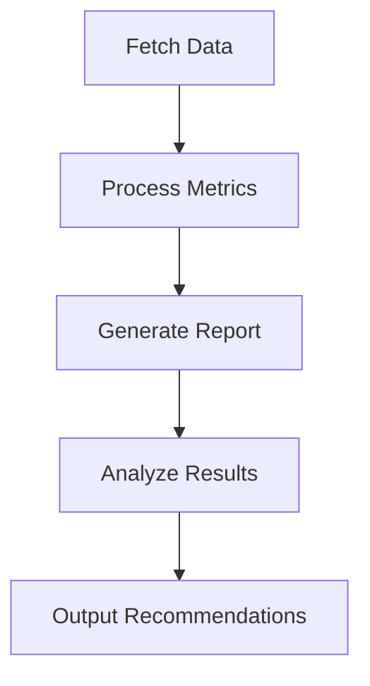

# Weather Data Analyzer (Go Implementation)

A concurrent Go application that fetches and analyzes weather data from Yandex Weather API to determine optimal travel destinations.

## Features

- 🌡️ Fetch weather data for multiple cities concurrently
- 📊 Calculate key weather metrics (temperature, precipitation)
- 🏆 Rank cities by travel favorability
- 📁 Generate comprehensive JSON reports

## Architecture

### Core Components

1. **Data Fetcher**
   - Concurrent API requests to Yandex Weather
   - Exponential backoff retry mechanism
   - Response caching
   - Error handling and logging

2. **Data Processor**
   - Calculates daily average temperature (9:00-19:00)
   - Counts precipitation-free hours
   - Aggregates statistics across multiple days

3. **Report Generator**
   - Creates structured JSON reports
   - Formats tabular data output
   - Saves results to file

4. **City Analyzer**
   - Implements scoring algorithm
   - Ranks cities by weather conditions
   - Generates travel recommendations

## Data Flow



## Configuration

Configure via config.yaml:

```yaml
badCondition:
  thunderstorm: "гроза"
  snow: "снег"
  rain: "дождь"

cities:
  Moscow: "https://code.s3.yandex.net/async-module/moscow-response.json"
  Sochi: "https://example.com/sochi-weather"
  Kazan: "https://example.com/kazan-weather"

fieldsEnToRU:
  temp: "Температура"
  condition: "Погодное условие"
  wind_speed: "Скорость ветра"

timeout: 5s
```

## Installation

1. **Clone repository**

```bash
git clone https://github.com/yourrepo/weatherAnalysis.git
```

2. **Build application**

```bash
go build -o weatherAnalysis cmd/main.go
```

## Usage

Basic usage:

```bash
./weather-analyzer -config config.yaml
```

Command line options:

```bash
  -cities string
        Comma-separated list of cities (overrides config)
  -output string
        Output file path (default "weather-report.json")
  -verbose
        Enable detailed logging
```

## Output Example

```json
{
  "report_date": "2023-06-15",
  "cities": [
    {
      "name": "Dubai",
      "average_temp": 34.2,
      "clear_hours": 85,
      "daily_breakdown": [...],
      "rating": 9.2
    }
  ],
  "recommendations": ["Dubai", "Miami"]
}
```

## Implementation Details

### Concurrency Model

- Goroutines for parallel API requests
- Worker pool pattern
- Channel-based communication

### Data Structures

```go
type CityWeather struct {
    Name      string
    Forecasts []DayForecast
    Metrics   CityMetrics
}

type DayForecast struct {
    Date       string
    Hours      []HourlyWeather
    DayTemp    float64
    ClearHours int
}
```

### Error Handling

- Retry mechanism for failed requests
- Circuit breaker pattern
- Graceful degradation

## Requirements

- Go 1.20+
- Yandex Weather API key
- Internet connection
